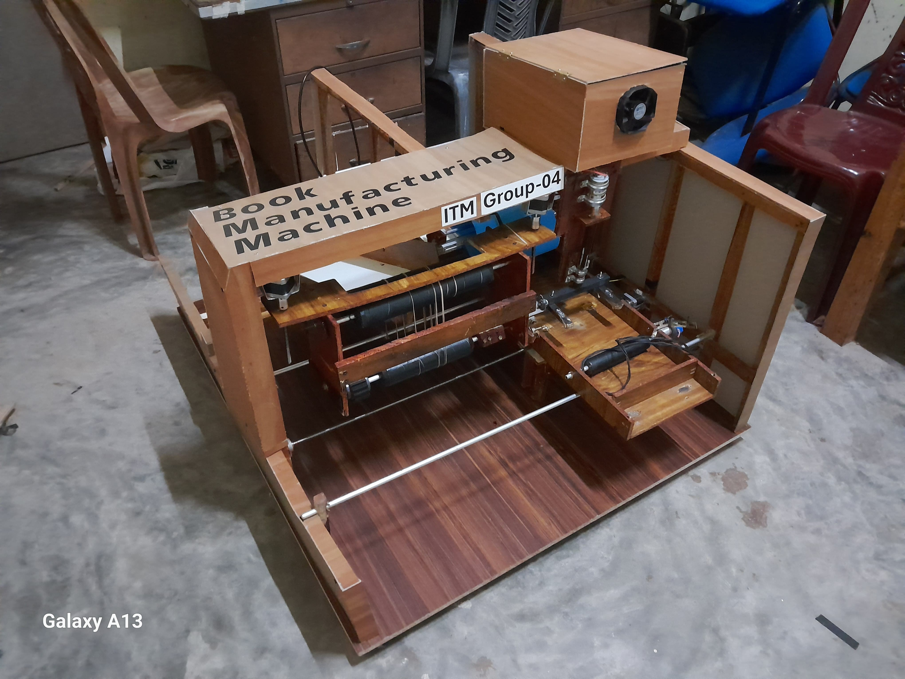
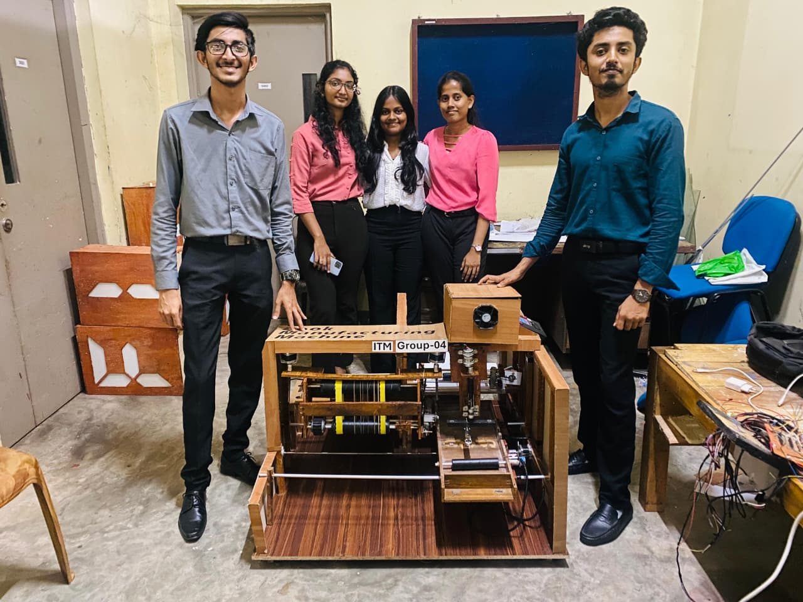

# Book Manufacturing Machine

An automated exercise book manufacturing system designed for Small and Medium Enterprises (SMEs). This Level 01 microcontroller-based hardware project provides a cost-effective solution for producing exercise books with minimal manual intervention.

## Project Overview

This machine automates the complete process of exercise book manufacturing including:
- Paper cutting and feeding
- Stapling
- Book folding
- Quality control with IR sensors

## Team

**ITM Group-04** - A team of 5 dedicated engineering students

## Hardware Components

- **Microcontroller**: Arduino-based control system
- **Display**: 16x2 LCD with I2C interface
- **Input**: 4x4 Keypad for user interaction
- **Motors**: 
  - Stepper motors for precise movement control
  - Wiper motor for folding mechanism
- **Sensors**: IR sensors for paper detection and positioning
- **Actuators**: Stapler mechanism for book binding

## Features

- **Automated Process**: Complete book manufacturing with single button press
- **Quality Control**: IR sensor-based paper detection and positioning
- **User Interface**: LCD display with status messages
- **Error Handling**: Comprehensive error detection and buzzer alerts
- **Precise Control**: Stepper motor-driven cutting and folding mechanisms

## Manufacturing Process

1. **Paper Detection**: IR sensors verify paper availability
2. **Cutting**: Automated paper cutting for multiple sheets
3. **Stapling**: Precise stapling mechanism binds the pages
4. **Transport**: Motorized tray moves books through stations
5. **Folding**: Automated folding unit creates final book shape
6. **Quality Check**: Final IR sensor confirms successful completion

## Control System

The system is controlled by Arduino with the following key functions:

```cpp
// Main process functions
void cutterNormal()     // Paper cutting mechanism
void staple()           // Stapling operation
void trayFoward()       // Move tray to folding station
void foldingUnit()      // Book folding process
void trayBackward()     // Return tray to start position
```

## Getting Started

### Prerequisites
- Arduino IDE
- Required Libraries:
  - Wire.h
  - LiquidCrystal_I2C.h
  - Keypad.h
  - CheapStepper.h

### Installation
1. Clone this repository
2. Install required libraries in Arduino IDE
3. Upload the code to your Arduino board
4. Connect hardware components as per circuit diagram
5. Power on and press 'A' to start manufacturing

## Operation

1. **Power On**: Machine displays welcome message
2. **Start Process**: Press 'A' on keypad to begin
3. **Automatic Operation**: Machine runs complete manufacturing cycle
4. **Completion**: Buzzer sounds when book is finished
5. **Error Handling**: Clear error messages displayed if issues occur

## Technical Specifications

- **Paper Capacity**: Designed for standard exercise book production
- **Production Speed**: Optimized for SME requirements
- **Power Supply**: Standard Arduino power requirements
- **Build Material**: Wooden frame construction for cost-effectiveness

# Project Images


*Complete book manufacturing machine with control panel*


*Internal view showing cutting, stapling, and folding mechanisms*


*ITM Group-04 team with the completed project*

## Educational Value

This project demonstrates:
- Microcontroller programming and interfacing
- Sensor integration and feedback systems
- Motor control and automation
- Mechanical design and fabrication
- Project management and teamwork

## Future Enhancements

- Variable book size capability
- Production counting system
- Remote monitoring interface
- Enhanced error diagnostics
- Increased production speed

*Empowering SMEs through accessible automation technology*